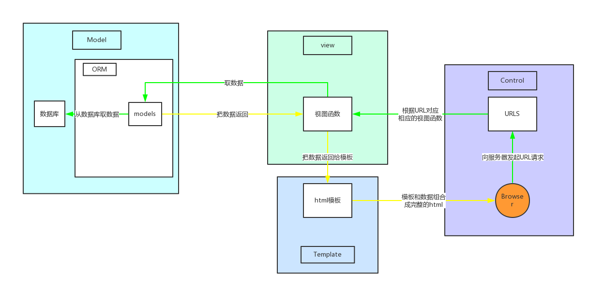
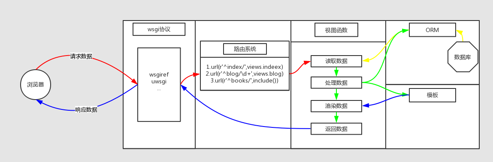

## 开始Django

### 第一个项目
1. 安装Django
	- 'pip3 install django'
2. 创建django项目
	- 'django-admin startproject 项目名'
3. 创建一个应用
	- 'python manage.py startapp 应用名'
	- 在urls.py添加视图函数
	- 在views.py编写视图函数，使用HttpResponse作为响应
4. 运行django项目
	- 'python manage.py runserver [[ip:]port]'
	- 默认host：127.0.0.1:8000

### MTV模型
Django使用的框架模型是MTV模型加控制，其中控制主要是URl的分发和映射。

- Django框架下的请求响应流程：
	1. 浏览器向服务器发出请求信息；
	2. 全局环境下的urls.py对请求信息中的URL处理，将URL中指定的路径分发至应用下的url处理文件或直接映射至应用下的视图函数；
	3. 视图函数接收请求数据，并根据请求数据做相应处理；
	4. 根据请求数据访问数据库，并提取数据；
	4. 将数据嵌入模板；
	5. 生成响应信息返回给浏览器。

### Django请求生命周期
- wsgi协议(web服务网关接口)接收请求数据
	- django默认使用内置wsgiref模块
	- 实际中常用uwsgi模块
	- ···
- 路由系统分发url
- 视图函数
	- FBV:函数视图/CBV:类视图
	- 使用ORM获取数据
		- 连上数据库读取数据
		- 转换为ORM对象返回
	- python语法处理数据
	- 模板语法渲染模板Templates
	- 生成响应字符串
	- 返回给wsgi
- wsgi协议(web服务网关接口)返回响应数据
- 注意：
	- 渲染工作在django中执行完成后，生成字符串返回给浏览器
	- 生成的html中需要的静态文件需要浏览器额外发一次请求才可获取文件

### Django基础知识
- 请求数据
	- 请求头
	- 空行
	- 请求体
- 路由系统
	- 常用：url(r'^index/',views.index)
	- 路由分发：include("app名.urls")
	- 分组：url(r'^blog/(?P<year>\d+)/(\d+)/',views.index)
- 视图函数
	- 读取数据
		- reqeust-->method,GET,POST,COOKIES,session,user,body,path
		- 如果路由有分组，可以在视图函数接收参数
	- 响应数据
		- render，redirect，HttpResponse
- ORM
	- 在mdodels定义类，继承Model，类为表，静态字段名为表字段，对象为记录
	- 类可以封装方法，比如__str__
	- 新增
	- 删除
	- 修改
	- 查询
- 模板
	- 静态文件
	- 模板语法
		- 变量，tag，过滤器，if，for
		- 自定义过滤器
		- 模板继承
- 设置文件
	- 数据库
	- 静态文件和模板

### 进阶
#### QueryDict
- request.GET
	- ?name=alex&age=18&age=19
	- params = {'name': ['alex',], 'age': ['18', '19']}
	- params._mutable = True
		- 默认reqeust.GET不可修改，需要修改保护
	- params['hobby'] = 'apple'
	- params.setlist('hobby', ['apple',])
